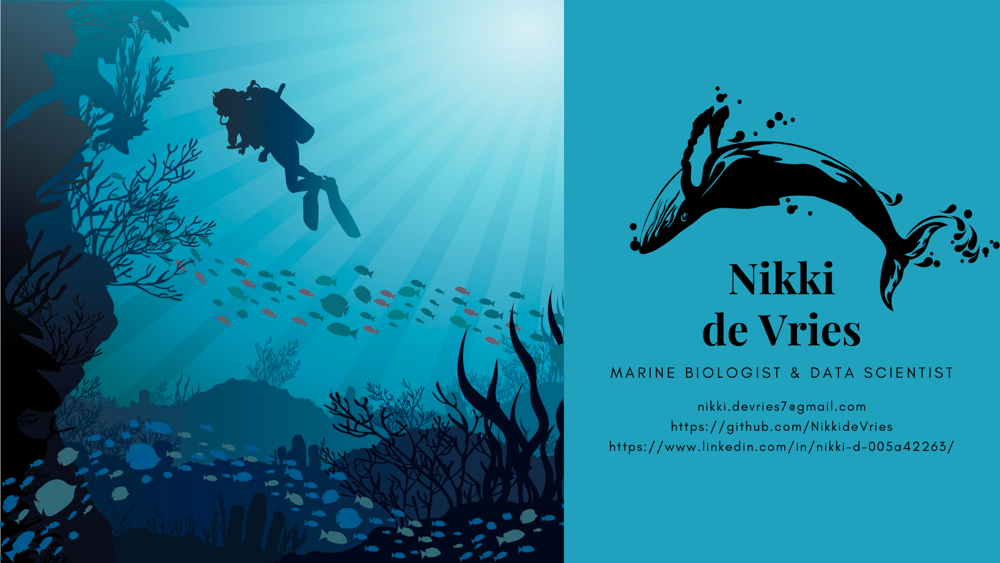

---

### :woman_technologist: About me:
Hello! I'm Nikki de Vries. I am currently learning data science from Codeup with a passion for data storytelling and finding new insights to solve problems with data. 

How did I come into data science?
For starters, I am a Marine Biologist and Environmental Scientist. I went to Texas A&M Corpus Christi, where I received my bachelor's. I worked in an environmental chemistry lab for a year, where I played a pivotal role in data collection by meticulously cleaning plastics and contributing over 2,500 data points. I researched data science in my senior year and became fascinated with the idea of being able to analyze and problem-solve using data. My biggest driver is that I want to use data science to help in marine biology and environmental science fields to create a better future.

---
### How to find me: 
- ✉️ My email: nikki.devries7@gmail.com
- 📃 My Linkedin: https://www.linkedin.com/in/nikki-d-005a42263/

<!---
NikkideVries/NikkideVries is a ✨ special ✨ repository because its `README.md` (this file) appears on your GitHub profile.
You can click the Preview link to take a look at your changes.
--->
